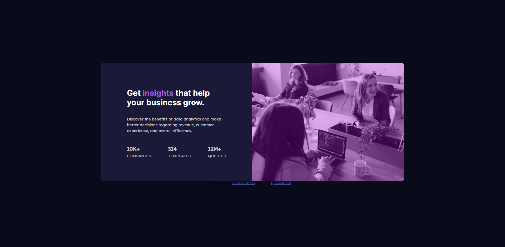

# Frontend Mentor - Stats preview card component solution

This is a solution to the [Stats preview card component challenge on Frontend Mentor](https://www.frontendmentor.io/challenges/stats-preview-card-component-8JqbgoU62). Frontend Mentor challenges help you improve your coding skills by building realistic projects. 

## Table of contents

- [Overview](#overview)
  - [The challenge](#the-challenge)
  - [Screenshot](#screenshot)
  - [Links](#links)
- [My process](#my-process)
  - [Built with](#built-with)
  - [What I learned](#what-i-learned)
  - [Useful resources](#useful-resources)

## Overview
The challenge was to reproduce a responsive website via html and css from the givem images.
### The challenge

Users should be able to:

- View the optimal layout depending on their device's screen size

### Screenshot


### Links

- Solution URL: (https://github.com/apurva-7/Projects.git)
- Live Site URL: (https://apurva-7.github.io/Projects/)

## My process

### Built with

- Semantic HTML5 markup
- CSS custom properties
- Flexbox
- CSS Grid
- Mobile-first workflow
- [Styled Components](https://styled-components.com/) - For styles
### What I learned

Use this section to recap over some of your major learnings while working through this project. Writing these out and providing code samples of areas you want to highlight is a great way to reinforce your own knowledge.

To see how you can add code snippets, see below:
```css
.show-on-mobile{
    display: none;
    @media screen and (max-width: 375px) {
        display: block;    
    }
}
.show-on-desktop{
    display: block;
     @media screen and (max-width: 1440px) {
      display: none;
  }
}
```
### Useful resources

- (https://stackoverflow.com/) - Godsend on finding quirky ideas
- (https://yoksel.github.io/flex-cheatsheet/) - Always a backup to remember flexbox in an interactive way.
- (https://developer.mozilla.org/en-US/) - Great documentation
- (https://www.udemy.com/course/the-web-developer-bootcamp/) - Amazing course and extensive course on html and css.